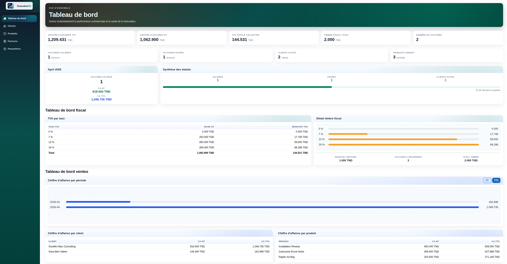
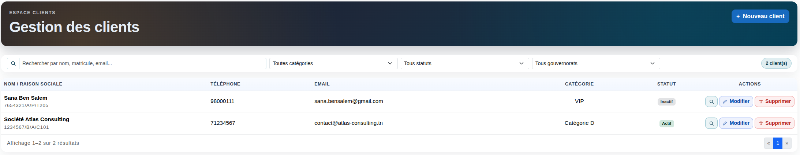
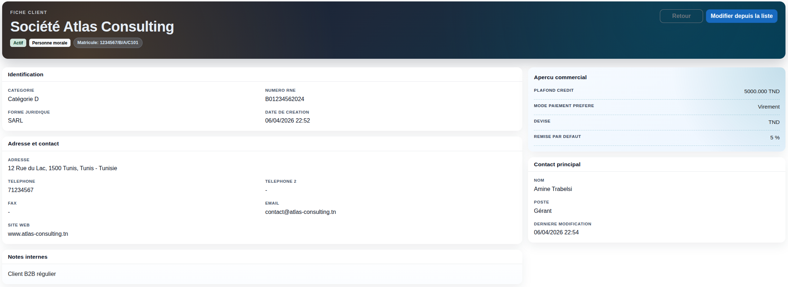
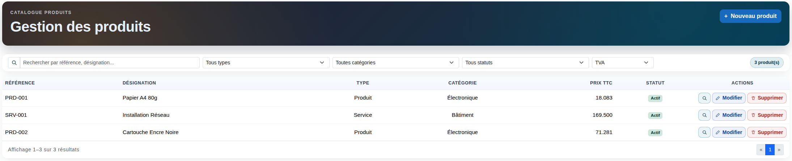
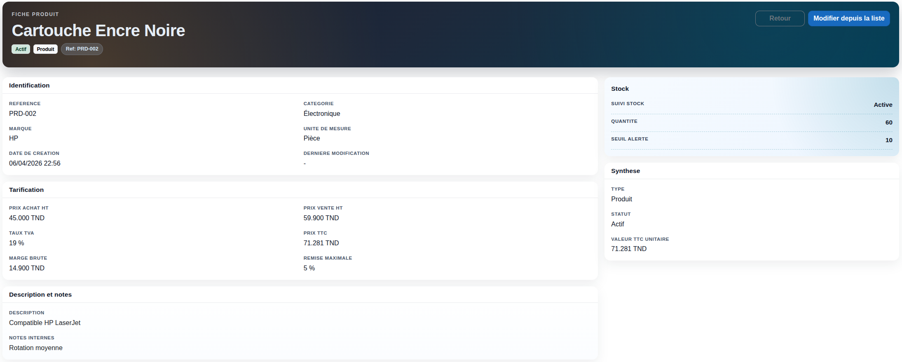
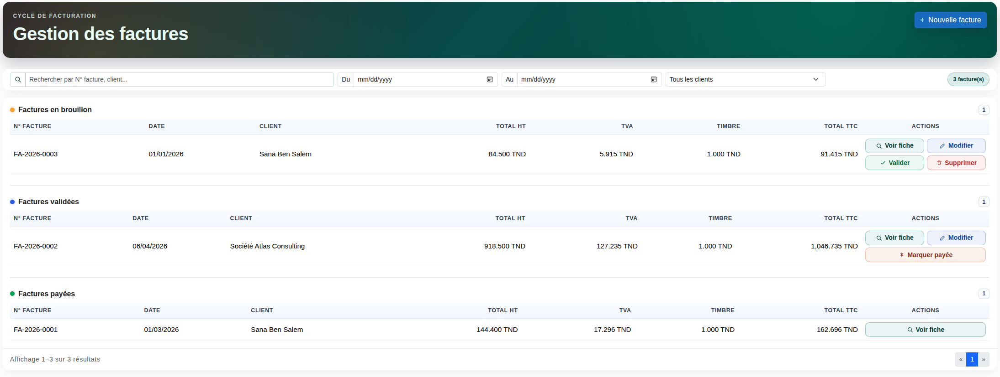
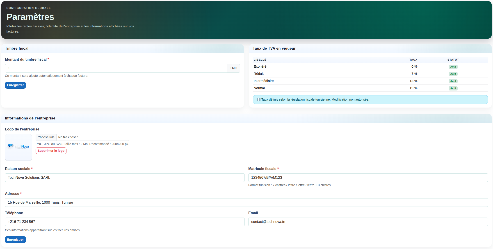
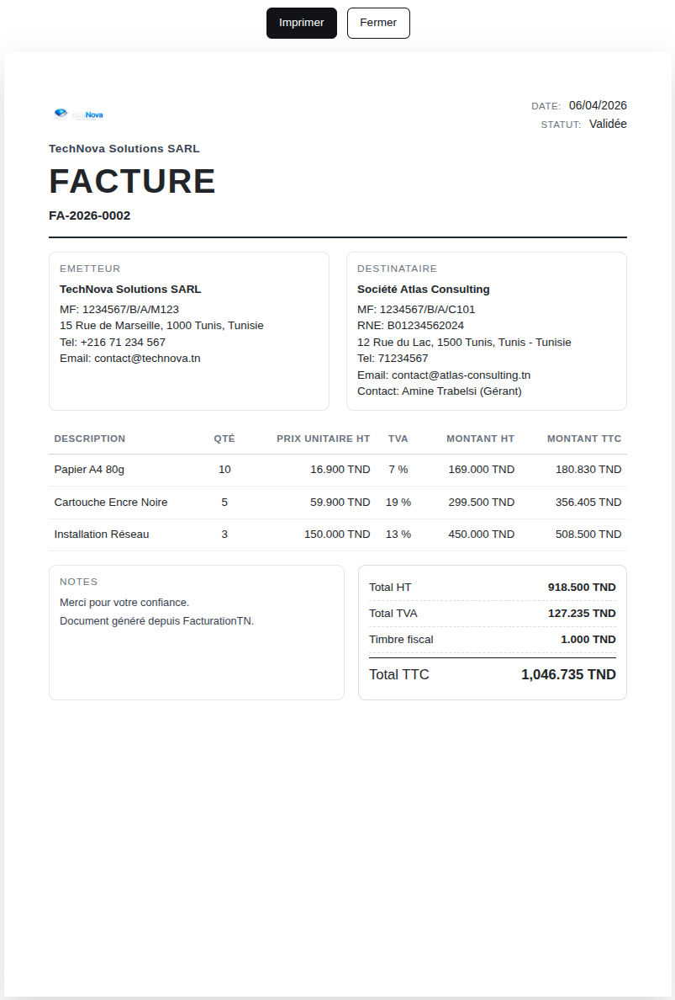

<p align="center">
	
</p>

<h1 align="center">FacturationTN</h1>

<p align="center">
	Modern invoicing platform for Tunisian workflows, built with Blazor Server, EF Core, and SQLite.
</p>

<p align="center">
	
	
	
	
</p>

---

## Table of Contents

| Section | Description |
|---------|-------------|
| [About](#about) | Project overview and goals |
| [Core Features](#core-features) | Main invoicing capabilities |
| [Tech Stack](#tech-stack) | Frameworks and tooling |
| [Project Structure](#project-structure) | Repository layout |
| [Getting Started](#getting-started) | Setup and first run |
| [Configuration](#configuration) | App settings and environment notes |
| [Database and Migrations](#database-and-migrations) | Schema lifecycle and seed data |
| [Usage Guide](#usage-guide) | Typical day-to-day flow |
| [Screenshots](#screenshots) | Visual tour of the app |
| [Deployment (Basic)](#deployment-basic) | Publish and production baseline |
| [Troubleshooting](#troubleshooting) | Common issues and fixes |
| [Known Limitations](#known-limitations) | Current boundaries |
| [Contributing](#contributing) | Contribution workflow |
| [License](#license) | Licensing status |

---

## About

FacturationTN is a Blazor Server invoicing application designed for Tunisian billing operations. It centralizes clients, products, invoices, fiscal stamp settings, and VAT handling with a practical back-office user interface.

### Key Highlights

| Capability | Description |
|------------|-------------|
| Client Management | Searchable client records with categories and status tracking |
| Product Catalog | Products/services with categories, units, pricing, and VAT |
| Invoice Lifecycle | Draft, validated, paid, and canceled states |
| Invoice Numbering | Automatic format: `FA-YYYY-NNNN` |
| Printable Output | Print-friendly invoice view |
| Persistent Storage | EF Core + SQLite with startup migration |

## Core Features

| Module | Included |
|--------|----------|
| Dashboard | Revenue, invoice stats, VAT, and fiscal stamp summaries |
| Clients | Create, search, filter, update, and review client details |
| Products | Manage references, pricing, VAT, categories, and units |
| Invoices | Create/edit invoices, validate, mark paid, cancel, print |
| Parameters | Fiscal stamp, company profile, logo, and VAT reference rates |

## Tech Stack

| Layer | Technology |
|-------|------------|
| Runtime | .NET SDK 10.0 |
| UI | ASP.NET Core Blazor Server (`net10.0`) |
| Data Access | Entity Framework Core 10 |
| Database | SQLite |
| UI Styling | Bootstrap |
| CLI Tooling | `dotnet-ef` (local tool) |

## Project Structure

```text
FacturationTN/
├─ FacturationTN.slnx
├─ README.md
└─ FacturationTN/
	├─ Components/
	│  ├─ Layout/          # Main layout, nav menu, print layout, reconnect modal
	│  └─ Pages/           # Home, Clients, Produits, Factures, Parametres, etc.
	├─ Data/
	│  └─ AppDbContext.cs  # EF model config + seed data
	├─ Models/             # Domain models and enums
	├─ Services/
	│  ├─ Interfaces/       # Service contracts
	│  └─ *.cs              # Service implementations
	├─ Migrations/          # EF Core migrations
	├─ wwwroot/             # Static assets (css, js, images)
	├─ Program.cs           # Startup, DI, middleware, auto-migrate
	└─ FacturationTN.csproj
```

## Architecture Notes

- `Components/Pages`: feature pages (dashboard, clients, products, invoices, parameters).
- `Services/Interfaces` and `Services`: application service contracts and implementations.
- `Data/AppDbContext.cs`: EF model configuration, constraints, and seed data.
- `Models`: domain entities, enums, and lookup entities.
- `Migrations`: schema history for controlled database evolution.
- `Program.cs`: DI, middleware, endpoint wiring, and auto-migrate startup behavior.

## Getting Started

### Prerequisites

| Requirement | Version |
|-------------|---------|
| .NET SDK | 10.0 |
| Git | Latest stable |

### 1. Clone the repository

```bash
git clone https://github.com/Khaledblel/facturation-tn
cd FacturationTN
```

### 2. Restore local tools

This project pins `dotnet-ef` as a local tool.

```bash
cd FacturationTN
dotnet tool restore
```

### 3. Restore and build

```bash
dotnet restore
dotnet build
```

### 4. Run the app

```bash
dotnet run
```

Default launch profiles expose:

- HTTP: `http://localhost:5231`
- HTTPS: `https://localhost:7278`

## Configuration

Main configuration is in `FacturationTN/appsettings.json`.

| Setting | Default |
|---------|---------|
| Connection string | `Data Source=FacturationTN.db` |
| Log level (default) | `Information` |
| ASP.NET Core log level | `Warning` |

Notes:

- `FacturationTN.db` is created in the application working directory.
- Override settings through `appsettings.Development.json` and environment variables.

## Database and Migrations

The app applies pending migrations automatically on startup via `db.Database.Migrate()` in `Program.cs`.

You can also run migration commands manually:

```bash
cd FacturationTN
dotnet ef migrations add <MigrationName>
dotnet ef database update
```

### Seeded Data

`AppDbContext` seeds useful defaults:

- Tunisian VAT rates (0, 7, 13, 19)
- Default system parameters
- Default client categories
- Default product categories
- Default units of measure

## Usage Guide

After startup, use the side navigation:

- `Tableau de bord`: overview dashboard
- `Clients`: create, search, filter, edit, and categorize clients
- `Produits`: manage products, categories, units, VAT assignments
- `Factures`: create and manage invoices and lifecycle state
- `Paramètres`: configure company details, fiscal stamp amount, and logo

Key workflow:

1. Add or update clients.
2. Add products and pricing/VAT data.
3. Create invoices with line items.
4. Validate or mark invoices paid.
5. Open print-friendly invoice page when needed.

## Screenshots

<table>
	<tr>
		<td align="center" width="50%">
			<br>
			<strong>Dashboard</strong><br>
			<sub>Business overview, VAT, and invoicing metrics</sub>
		</td>
		<td align="center" width="50%">
			<br>
			<strong>Clients</strong><br>
			<sub>Search, filters, status, and CRUD actions</sub>
		</td>
	</tr>
	<tr>
		<td align="center" width="50%">
			<br>
			<strong>Client Details</strong><br>
			<sub>Commercial profile and contact information</sub>
		</td>
		<td align="center" width="50%">
			<br>
			<strong>Products</strong><br>
			<sub>Catalog management with VAT and categories</sub>
		</td>
	</tr>
	<tr>
		<td align="center" width="50%">
			<br>
			<strong>Product Details</strong><br>
			<sub>Pricing, VAT, stock, and metadata snapshot</sub>
		</td>
		<td align="center" width="50%">
			<br>
			<strong>Invoices</strong><br>
			<sub>Grouped invoice states and lifecycle actions</sub>
		</td>
	</tr>
	<tr>
		<td align="center" width="50%">
			<br>
			<strong>Parameters</strong><br>
			<sub>Fiscal stamp, VAT table, and company identity</sub>
		</td>
		<td align="center" width="50%">
			<br>
			<strong>Invoice Print</strong><br>
			<sub>Print-ready invoice rendering</sub>
		</td>
	</tr>
</table>

## Deployment (Basic)

Create a Release publish output:

```bash
cd FacturationTN
dotnet publish -c Release -o ./publish
```

Basic deployment checklist:

- Set `ASPNETCORE_ENVIRONMENT` appropriately (`Production` for production hosts).
- Ensure the host process can read/write the SQLite database location.
- Override connection string if you need the database in a different path.
- Serve behind HTTPS in production.

## Troubleshooting

| Issue | Resolution |
|-------|------------|
| `dotnet-ef` not found | Run `dotnet tool restore` in the project folder |
| Port already in use | Edit `applicationUrl` in `Properties/launchSettings.json` or free the port |
| Migration fails on startup | Run `dotnet ef database update` manually and inspect migration history |
| SQLite permission error | Move DB to a writable location and update `DefaultConnection` |

## Known Limitations

- No authentication/authorization layer is currently configured.
- No automated test project is included yet.
- Basic deployment guidance only; no container or cloud template in repository.

## Contributing

1. Create a feature branch.
2. Keep changes focused and consistent with the current structure (`Components`, `Services`, `Data`, `Models`).
3. If your change modifies persistence, add an EF migration.
4. Verify the app builds and runs locally before opening a PR.
5. In your PR description, include:
	- Problem statement
	- What changed
	- Migration impact (if any)
	- Manual test notes

## License

This project is licensed under the MIT License.

See `LICENSE` for full text.

---

<p align="center">
	<a href="#facturationtn">Back to top</a>
</p>
